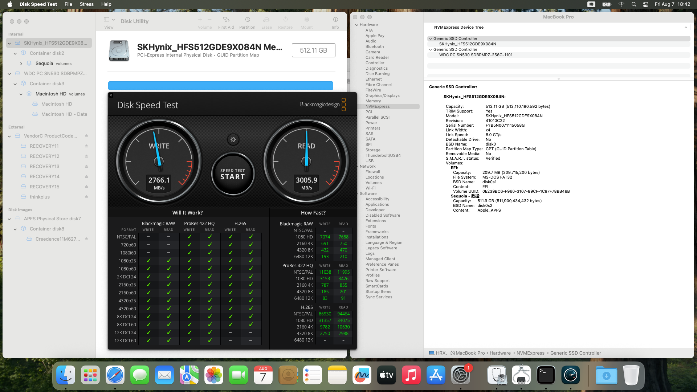

# PC711Probe

English | [简体中文](README_CN.md)

An automatic Lilu compatibility plugin that fixes an `IONVMeFamily` Identify-timeout kernel panic affecting tested SK hynix PC711 and BC711 NVMe drives on older macOS releases.

> **New finding: PC711 works natively on macOS 26.** The same physical PC711 was identified by Apple `IONVMeFamily` on macOS 26.5.1 (25F80 / Darwin 25.5.0), with working I/O and sleep/wake. Neither PC711Probe nor NVMeFix was required. PC711Probe does not load on macOS 26.

> [!IMPORTANT]
> The recommended `PC711Probe.kext` matches PCI `1C5C:174A` with NVMe class `01:08:02`. Version 1.8.0 and later also provide an opt-in `PC711ProbeForce.kext` that ignores Vendor/Device ID and applies the MSI-X compatibility path to every NVMe class `01:08:02` controller in the machine. Never load both variants. Use Force only when the standard build cannot match a known affected drive, with a rollback EFI and current data backup.

> [!NOTE]
> ## ❤️ Support PC711Probe
>
> Donations directly support my continued development of PC711Probe, hardware testing, and future macOS compatibility work.
>
> **[Support the project](SUPPORT.md)**

## Verified result

PC711Probe has now been reported working with one PC711 (`SKHynix_HFS512GDE9X084N`) and two BC711 models (`HFM512GD3JX016N` and `HFM512GD3JX013N`). The PC711 completed the full macOS 11–15 matrix and extended macOS 15.7.9 validation below; both 512 GB BC711 variants also passed functional testing. The former Identify/command timeout panic after roughly 75 seconds did not recur.



| Item | Verified value |
|---|---|
| Controller | SK hynix `1C5C:174A`, NVMe class `01:08:02` |
| Model | `SKHynix_HFS512GDE9X084N` (PC711) |
| Firmware | `41010C22` |
| Recovery boot verified | macOS 11.6 (20G165), 12.5.1 (21G83), 13.4.1 (22F82), 14.6.1 (23G93) |
| Full installation verified | macOS 15.6.1, build 24G90, Darwin 24.6.0 |
| Extended validation | macOS 15.7.9, build 24G830: 96 GiB sequential write/read/hash, dual 8 GiB parallel I/O, 20,000 small files, 3 sleep/wake cycles, 3 reboots, and APFS verification |
| macOS 15 link/status | PCIe 3.0 x4, 8.0 GT/s, TRIM: Yes, S.M.A.R.T.: Verified |
| macOS 15 measured result | 2766.1 MB/s write, 3005.9 MB/s read (Blackmagic Disk Speed Test) |
| Native OS | macOS 26.5.1, build 25F80, Darwin 25.5.0 |
| Boot environment | OpenCore 1.0.8, Lilu 1.7.3 |

Additional successful BC711 model strings: `HFM512GD3JX016N` and `HFM512GD3JX013N`. Their detailed firmware, platform, and stress-test matrices have not yet been recorded.

## Two build variants

Version 1.8.0 and later build two mutually exclusive Kexts:

| Kext | Matching | Intended use |
|---|---|---|
| `PC711Probe.kext` | PCI `1C5C:174A` and NVMe class `01:08:02` | Recommended default for known PC711/BC711 174A systems |
| `PC711ProbeForce.kext` | Any PCI Vendor/Device with NVMe class `01:08:02` | Opt-in fallback for an affected drive with a different PCI ID |

The model string is unavailable until the first Identify succeeds, so neither build can select by model name. The Force build removes the PCI Vendor/Device gate from both the early IOKit personality and the runtime route; it therefore applies to every NVMe controller in the machine, including controllers that may not need the patch. The two Kexts deliberately share one bundle identifier and must never be enabled together.

Both builds require no activation argument and load only on Darwin 20–24 (macOS 11–15). They do not load on Darwin 25/macOS 26, where the tested PC711 works natively.

## How it works

Without the patch, the PC711 controller reaches Ready state (`CSTS=1`), but Identify or another early NVMe command may never complete through the older interrupt path and eventually panics after roughly 75 seconds.

Comparison of older Apple `IONVMeFamily` builds with macOS 26 showed that the newer OS requests one MSI-X vector before creating the interrupt source and removes an older MSI-X-specific path. For the matched PC711, PC711Probe:

1. requests MSI-X during early PCI matching on macOS 11–15, before Recovery or Installer can issue sensitive polled commands;
2. uses Big Sur's original PCI message-interrupt allocator on macOS 11 and `IOPCIDevice::configureInterrupts` on macOS 12–15;
3. keeps the interrupt-source route as a fallback and clears the old selector on macOS 14–15; and
4. declines attachment, leaving Identify, queues, namespaces, and all storage I/O to Apple `IONVMeFamily`.

[Read the concise development process](docs/DEVELOPMENT.en.md)

## Installation

1. Back up the current EFI and start with a rollback-capable test USB.
2. Choose exactly one build: normally `PC711Probe.kext`; use `PC711ProbeForce.kext` only when the standard PCI matcher cannot target the affected drive.
3. Install Lilu 1.6.1 or newer and ensure it loads before the selected PC711Probe variant. The latest Lilu release is recommended.
4. Copy the selected Kext to `EFI/OC/Kexts` and add it under `Kernel -> Add`:
   - `BundlePath`: `PC711Probe.kext` or `PC711ProbeForce.kext`
   - `ExecutablePath`: `Contents/MacOS/PC711Probe`
   - `PlistPath`: `Contents/Info.plist`
   - `MinKernel`: `20.0.0`
   - `MaxKernel`: `24.99.99`
5. Disable AML/SSDT code that hides the target through `_STA=0` or spoofed class/vendor/device values.
6. Do not add a PC711Probe activation boot argument and do not enable both variants.

Use `-pc711poff` only as an emergency disable switch. Use `-pc711pdbg` for debug logging.

Safe Mode is not currently validated or enabled. Use a normal boot or Recovery when testing or rolling back PC711Probe.

[Full English installation and rollback guide](docs/INSTALL.en.md)

## Build

```bash
git clone --recurse-submodules https://github.com/hrx114514x/PC711Probe.git
cd PC711Probe
./Scripts/verify.sh
```

Outputs: `build/Debug/PC711Probe.kext` and `build/Debug/PC711ProbeForce.kext`

## Current validation boundary

Recovery boot is verified on macOS 11–14. A complete macOS 15.6.1 installation, normal system boot, namespace/partition publication, PCIe 3.0 x4 link, reported TRIM support, S.M.A.R.T. status, and a 2766.1/3005.9 MB/s write/read benchmark are verified on the tested PC711. On macOS 15.7.9, the same drive also passed 96 GiB of sequential write/read/two-pass SHA-256 validation, dual 8 GiB parallel I/O, 20,000 small-file operations, three sleep/wake cycles, three reboots, and APFS verification without a panic, NVMe timeout, I/O error, media loss, or hash mismatch.

The deepest matrix covers one physical PC711 (`SKHynix_HFS512GDE9X084N`), firmware `41010C22`, on one AMD platform. Two BC711 models, `HFM512GD3JX016N` and `HFM512GD3JX013N`, have also passed functional testing, but their detailed firmware/platform matrices and the same extended workload have not yet been recorded. The Force build is compile/static-validated but has not yet received separate hardware validation. Keep a rollback EFI and data backup for the first test, and submit independent results through [GitHub Issues](https://github.com/hrx114514x/PC711Probe/issues).

## License

Copyright © 2026 hrx114514x.

PC711Probe v1.2.0 and later are source-available under the [PolyForm Noncommercial License 1.0.0](LICENSE). Use, modification, and distribution are permitted for personal study, research, experimentation, hobby projects, and other noncommercial purposes.

Commercial use is prohibited without separate written permission from the copyright holder, including but not limited to:

- selling PC711Probe or modified builds;
- bundling it with paid EFI or other commercial packages;
- using it in paid Hackintosh installation, repair, or support services; and
- any other commercial distribution or exploitation.

Previously published v0.6.0 and v1.0.0 releases remain available under the BSD 3-Clause license that accompanied them. This change does not retroactively withdraw rights already granted.

Third-party dependencies remain under their own licenses; see [THIRD_PARTY_NOTICES.md](THIRD_PARTY_NOTICES.md). No Apple Kernel Collection or `IONVMeFamily` binary is redistributed.
