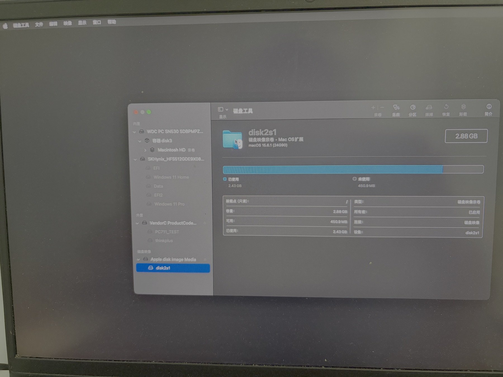

# PC711Probe

[English](README.md) | 简体中文

用于修复 SK hynix PC711 在旧版 macOS 中初始化时发生 `IONVMeFamily` Identify 超时 Kernel Panic 的自动 Lilu 兼容插件。

> **新发现：PC711 在 macOS 26 已经原生免驱。** 同一块实机 PC711 在 macOS 26.5.1（25F80 / Darwin 25.5.0）中可由 Apple `IONVMeFamily` 正常完成识别、读写和睡眠唤醒，不需要 PC711Probe 或 NVMeFix。PC711Probe 不在 macOS 26 加载。

> [!NOTE]
> ## ❤️ 支持 PC711Probe
>
> 赞助会直接支持我继续开发 PC711Probe、进行硬件测试和后续 macOS 兼容性工作。
>
> **[查看赞助方式](SUPPORT.md)**

## 已验证结果

PC711Probe 已在同一块 PC711 上通过 macOS 13.4.1 与 macOS 15.6.1 Recovery 硬件启动验证：系统进入磁盘工具，型号及五个既有分区全部被枚举，原先约 75 秒后的 NVMe 命令超时 KP 不再出现。macOS 11.6 目前仍会 KP，尚未支持。



| 项目 | 已验证值 |
|---|---|
| 控制器 | SK hynix `1C5C:174A`，NVMe class `01:08:02` |
| 型号 | `SKHynix_HFS512GDE9X084N`（PC711） |
| 固件 | `41010C22` |
| v1.2.0 验证成功 | macOS 13.4.1，Build 22F82，Darwin 22.5.0 |
| 既有验证成功 | macOS 15.6.1，Build 24G90，Darwin 24.6.0 |
| 本机启动正常 | macOS 12.5.1（21G83）、macOS 14.6.1（23G93）Recovery |
| 当前未支持 | macOS 11.6（20G165），仍发生原始 NVMe 超时 KP |
| 原生系统 | macOS 26.5.1，Build 25F80，Darwin 25.5.0 |
| 引导环境 | OpenCore 1.0.8，Lilu 1.7.3 |

## 自动匹配范围

1.2.0 不需要任何启用参数。Kext 加入 OpenCore 后自动运行，只对以下控制器应用补丁：

- PCI Vendor/Device：`1C5C:174A`；
- NVMe class：`01:08:02`。

PC711 的型号字符串必须等第一次 Identify 成功后才能读取，因此插件使用其已知 PCI 控制器 ID 进行预先匹配；不同容量和 OEM 型号不依赖字符串判断。其他 PCI ID 的 NVMe 保持 Apple 原始行为。

插件声明的自动运行范围为 Darwin 20–24（macOS 11–15）。Darwin 25/macOS 26 不加载插件。macOS 11 虽在加载范围内，但目前实测仍会 KP。

## 原理

macOS 15.6.1 中，PC711 控制器已经 Ready（`CSTS=1`），但第一条 Identify Controller 命令无法通过旧中断完成路径返回，最终超时 KP。

对比旧版与 macOS 26 的 Apple `IONVMeFamily` 后发现，新系统会在创建中断源前请求一个 MSI-X 向量，并移除了旧 MSI-X 特殊路径。PC711Probe 对匹配的 PC711：

1. 在 macOS 11–13 的 PCI 匹配早期请求一个 MSI-X 向量，随后主动放弃设备绑定；
2. Apple `IONVMeFamily` 继续作为真正的 NVMe 驱动接管设备；
3. 在 macOS 14–15 创建中断源时请求 MSI-X，并清除旧中断路径选择位；
4. 其余 Identify、队列、namespace 和存储 I/O 继续由 Apple 驱动完成。

[查看简明开发过程](docs/DEVELOPMENT.zh-CN.md)

## 安装

1. 备份现有 EFI，并先使用可回滚的测试 USB。
2. 确保 Lilu 先于 PC711Probe 加载。
3. 将 `PC711Probe.kext` 放入 `EFI/OC/Kexts` 并添加到 `Kernel -> Add`：
   - `BundlePath`: `PC711Probe.kext`
   - `ExecutablePath`: `Contents/MacOS/PC711Probe`
   - `PlistPath`: `Contents/Info.plist`
   - `MinKernel`: `20.0.0`
   - `MaxKernel`: `24.99.99`
4. 停用通过 `_STA=0`、伪造 class/vendor/device 等方式隐藏 PC711 的 AML/SSDT。
5. 不需要添加任何 PC711Probe 启动参数。

紧急关闭可使用 `-pc711poff`。调试日志可使用 `-pc711pdbg`。

[完整中文安装与回滚指南](docs/INSTALL.zh-CN.md)

## 构建

```bash
git clone --recurse-submodules https://github.com/hrx114514x/PC711Probe.git
cd PC711Probe
./Scripts/verify.sh
```

输出：`build/Debug/PC711Probe.kext`

## 当前验证边界

已验证 macOS 13/15 Recovery 中的控制器初始化、Identify、namespace 和分区发布；macOS 12/14 Recovery 在本机启动正常。macOS 11 尚未修复，完整安装、持续读写、TRIM、睡眠唤醒，以及其他固件和平台也未完成硬件验证。首次使用请保留回滚 EFI 和数据备份。

## 许可

Copyright © 2026 hrx114514x。

PC711Probe v1.2.0 及后续版本以源码公开形式按照 [PolyForm Noncommercial License 1.0.0](LICENSE) 提供。个人学习、研究、实验、业余项目及其他非商业用途可以使用、修改和分发。

未经版权持有人单独书面授权，不允许任何商业用途，包括但不限于：

- 销售 PC711Probe 或修改版；
- 捆绑进收费 EFI 或其他付费软件包；
- 用于收费黑苹果安装、维修或技术服务；
- 以其他方式进行商业分发或商业利用。

此前已经按照 BSD 3-Clause 发布的 v0.6.0 和 v1.0.0 继续适用其原许可证；本次变更不追溯撤销已经授予的权利。

第三方依赖继续适用各自许可证，详见 [THIRD_PARTY_NOTICES.md](THIRD_PARTY_NOTICES.md)。仓库不包含 Apple Kernel Collection 或 `IONVMeFamily` 二进制。
